# ARCHITECTURE.md — Local-First LLM Privacy Gateway

> **How to read this.** This document describes **what the system is and why it is shaped this way**. It does not describe how we build it (see `BUILD.md`) or how we write code (see `CLAUDE.md`). The three are read together.
>
> The architecture described here is **frozen**. Objections are welcome and belong in `docs/DECISIONS.md`; they do not belong in a pull request.

---

## Executive Summary

### What the system does

An application sends a request to a cloud LLM. That request routinely contains data the application never intended to share: a customer's Aadhaar in a support ticket, a colleague's name in a summarisation prompt, a PAN buried inside a tool-call argument. Once it leaves the machine, it is gone — logged, retained, possibly trained on.

This system is a **local-first egress proxy**. It exposes an OpenAI-compatible surface, intercepts every outbound request body, detects sensitive entities, and replaces them with **realistic, format-preserving surrogates** before the bytes leave the host. The upstream provider receives a request that is structurally identical and semantically intact, but contains no real sensitive data. The streaming response is **rehydrated** on the way back, so the caller sees the real values.

The provider sees `ABCDE1234F`. The user sees their real PAN. Neither side notices the proxy.

### One-line integration

```python
client = OpenAI(base_url="http://localhost:8080/v1", api_key="...")
```

That is the entire integration. No SDK, no wrapper, no code change beyond the base URL. This constraint is load-bearing: it is why the OpenAI wire format is the interface, and it is why streaming correctness is non-negotiable rather than a nice-to-have.

### Primary objective

**The proxy is not the contribution.** The gateway pattern — reversible, format-preserving pseudonymisation between an application and an LLM — is shipped in production today by Skyflow (LLM Privacy Vault), Google Cloud DLP (FF1-based deterministic surrogates, reversible, since ~2019), LiteLLM guardrails, Cloudflare AI Gateway, and Portkey. This system is a competent reimplementation of a solved pattern, and says so in its own README.

The contribution is **two evaluation artifacts that do not currently exist**:

1. **A fairly-baselined Indian-PII benchmark.** Every commercial tool is weak on Aadhaar, PAN, IFSC, UPI, vehicle registration, and Hinglish/code-switched names. No public benchmark measures this against a *fairly configured* baseline.
2. **An adversarial bypass suite that reports the bypasses that still work.**

Every other component in this system exists to make those two artifacts meaningful. If the detector is mediocre but the benchmark is rigorous, the project succeeded. The reverse is a failure.

### Why this architecture was chosen

Four decisions define the shape of the system, and each was made against a specific rejected alternative.

**Egress proxy, not MCP proxy.** The obvious framing — "a privacy layer for agentic AI at the MCP protocol layer" — is architecturally wrong for this goal. MCP sits between a *host* and *tool servers*. It carries tool calls and tool results. It does **not** carry the inference request to Anthropic or OpenAI; the host makes that call directly over the provider's own HTTPS API. An MCP proxy therefore cannot see the prompt, cannot sanitise it, and cannot rehydrate the model's answer, because the answer never passes through it. The pseudonymise/rehydrate round trip — the entire value proposition — is only possible at the egress layer.

**Surrogates, not redaction.** `[REDACTED]` destroys the model's ability to reason: it cannot resolve coreference, cannot maintain a consistent narrative, cannot answer "who approved this?". Format-preserving surrogates preserve structure and semantics, which is what makes the privacy property nearly free in terms of task quality. The cost is that we must now solve consistency, invertibility, and collision — which is where the real engineering lives.

**Mock provider as the default upstream.** A demo that requires an API key is a demo nobody runs. More importantly, a test suite that requires a paid API is a test suite that cannot force pathological chunk boundaries. The mock upstream is the test harness, the CI backbone, and the demo — and it is arguably the better demo, because the interviewer's eye goes directly to *what the upstream actually received*.

**No persistence, anywhere.** A session vault of real→surrogate mappings would be a centralised, plaintext-recoverable store of every sensitive value the user ever sent. Before the gateway, that PII was scattered across prompts. A vault concentrates it. Building a new PII database in the name of privacy is a threat-model inversion, and we refuse it: structured entities use keyed FF1 and need no map at all; names use an in-memory, session-scoped map that dies with the session.

---

## System Goals

### Functional goals

| # | Goal |
|---|---|
| F1 | Expose an OpenAI-compatible `/v1/chat/completions`, streaming and non-streaming, such that the stock `openai` SDK works unmodified against it |
| F2 | Detect Indian structured entities — Aadhaar, PAN, IFSC, UPI ID, vehicle registration — with checksum validation where the format permits |
| F3 | Detect global structured entities — payment card (Luhn), email, phone |
| F4 | Detect unstructured entities — person, organisation, address — in English and Hinglish/code-switched text |
| F5 | Substitute detected entities with format-preserving, checksum-valid surrogates that are **consistent within a session** |
| F6 | Sanitise the **entire request body** — system prompt, every message role, tool/function definitions, tool-result messages, function-call arguments, `name` fields — not merely `messages[].content` |
| F7 | Rehydrate surrogates in the response stream back to real values, correctly across arbitrary SSE chunk boundaries |
| F8 | Recognise surrogates arriving on **ingress** (from prior assistant turns) and pass them through without re-encryption |
| F9 | Run end-to-end, including the full test suite and both evaluation runners, with **no API key and no network** |
| F10 | Regenerate every published metric from a committed artifact via a single command |

### Non-functional goals

| # | Goal | Notes |
|---|---|---|
| N1 | **Honest measurement** | Every number reproducible; unfavourable results published |
| N2 | **No PII at rest, ever** | Not on disk, not in logs, not in exception messages, not in artifacts |
| N3 | **CPU-only** | Windows 11, i7, no GPU. The Tier-2 model must be small enough to be irrelevant to the story |
| N4 | **Transparent latency accounting** | Per-tier p50/p95/p99, cold start separated, TTFT reported independently of total |
| N5 | **Silent-failure hostility** | Every failure mode here is quiet by nature; the architecture must make failures *testable*, which is why every dependency is injected |
| N6 | **Explicability** | A reviewer asking "why?" about any decision finds the answer already written down |

### Explicitly out of scope

These were considered and **cut**. They are not deferred-by-oversight; they are deleted by decision.

- **Tier 3 / contextual inference risk.** Detecting quasi-identifiers ("our only female VP in the Hyderabad office") has no ground truth over free text with no reference population. No ground truth → no recall number → not evaluable → a demo, not a system. See *Detection Pipeline* for the full reasoning.
- **Policy engine.** A YAML per-entity/per-destination rules layer is two hours of work and zero engineering depth. A reviewer sees a config file.
- **Multi-provider.** Plumbing, not signal. One OpenAI-compatible interface.
- **Persistent vault / cross-session state.** Threat-model inversion. See *Security Architecture*.
- **UI, browser extension, dashboard.** CLI, curl, and logs.
- **MCP shim.** Architecturally coherent as an *addition* (sanitising tool results on the way *into* context), but a different product with no rehydration story. Deferred out of this build.
- **Fine-tuning.** Only if evaluation proves the Tier-2 model is the binding constraint, and only if time remains.

---

## High-Level Architecture

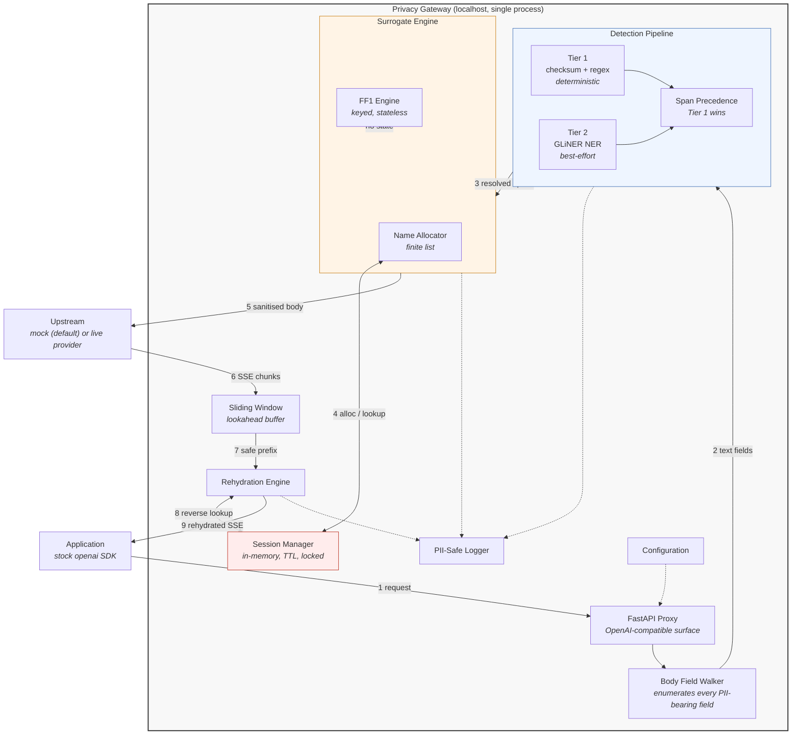

Two properties of this diagram matter more than the boxes:

**The FF1 engine has no line to the Session Manager.** That is the point. Structured entities are invertible with a key alone. Only the Name Allocator needs state, and that asymmetry is the most interesting thing in the system — see *Surrogate Architecture*.

**Everything crossing the gateway boundary is dashed to the logger.** The logger is a security control, not an observability convenience. See *Logging Architecture*.

### Layering and dependency direction

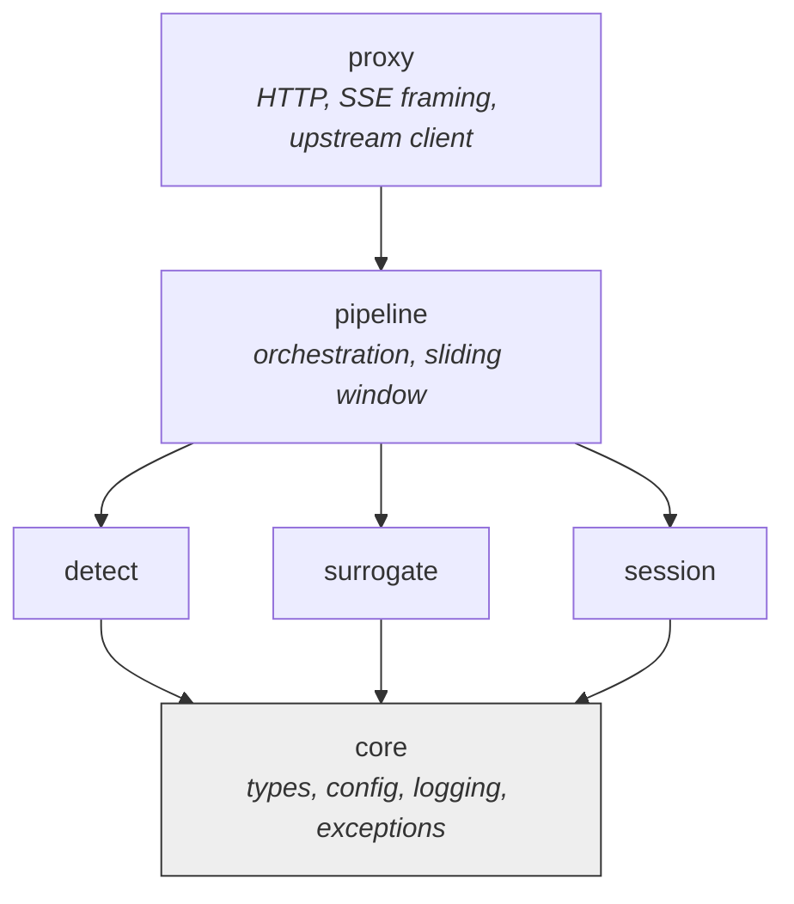

Dependencies point in one direction only. `core` imports nothing internal. Detectors do not know HTTP exists. The pipeline does not know which detector fired. This is what makes the mock detectors, the forced-collision tests, and the pathological-chunk tests writable at all.

---

## Component Architecture

### 1. FastAPI Proxy

| | |
|---|---|
| **Purpose** | Present an OpenAI-compatible surface and preserve wire semantics exactly |
| **Responsibilities** | Route `/v1/chat/completions` (streaming + non-streaming) and `/health`; parse and re-serialise the request body; preserve SSE framing including `[DONE]`; propagate upstream status codes and error bodies; assign a correlation ID per request; enforce `FAIL_MODE` |
| **Inputs** | HTTP request from any OpenAI-compatible client |
| **Outputs** | HTTP response or SSE stream, wire-identical in shape to the upstream's |
| **Dependencies** | Configuration, pipeline, upstream client (injected), logger |
| **Failure modes** | Malformed body → 400 with a typed error, no upstream call. Upstream timeout/5xx → propagated, `FAIL_MODE` decides whether an internal detector failure leaks or 503s. **Silently altering SSE framing is the nastiest failure here** — the client's SDK breaks in ways that look like a provider bug, not a proxy bug. |

The proxy is deliberately thin. It owns bytes and framing; it owns no privacy logic.

### 2. Mock Provider

| | |
|---|---|
| **Purpose** | Be the default upstream: test harness, CI backbone, and demo, in that order of importance |
| **Responsibilities** | Serve an OpenAI-compatible `/v1/chat/completions`; echo the received body back as streamed content; **force pathological chunking on demand** — split a configured string across N chunks, split mid-token, emit zero-content chunks, terminate with a correct `[DONE]`; optionally echo names in decorated (`**Arjun Reddy**`), partial (`Arjun`), or abbreviated (`A. Reddy`) forms to exercise rehydration fidelity |
| **Inputs** | A sanitised request body, plus chunking directives |
| **Outputs** | SSE stream |
| **Dependencies** | None. Runs offline, no keys. |
| **Failure modes** | If the mock's SSE framing diverges from real providers, every test passes and production breaks. Its framing must be validated once against a real provider capture, and that capture committed as a fixture. |

The mock is not a stub. It is the only component that can produce the failure conditions this system exists to survive, and it is the reason a reviewer can run the demo in one command with no key.

### 3. Body Field Walker

| | |
|---|---|
| **Purpose** | Enumerate every field in a request body that can carry PII |
| **Responsibilities** | Walk system prompts, all message roles, tool/function definitions, tool-result messages, function-call arguments (which are JSON-in-a-string), and `name` fields; hand each text region to the pipeline; reassemble the body with substitutions applied at exact offsets |
| **Inputs** | Parsed request body |
| **Outputs** | An ordered list of text regions with their structural paths |
| **Dependencies** | Core types |
| **Failure modes** | **The field you forget is the leak.** This is the highest-consequence, lowest-glamour component in the system. PII in a tool schema is still PII, and it never appears in a naive `messages[].content` demo. The covered-field list is enumerated deliberately and recorded in `PROJECT_STATE.md`. |

**Walking a field and detecting PII in it are two separate decisions
(Phase 7).** The walker enumerates every text-bearing field
unconditionally, with no notion of what a field means — including a
message's `role`, which it always finds and always round-trips through
`rebuild()`. Whether a given region is actually handed to the detection
cascade is a policy decision that lives one layer up, in
`src/pipeline/sanitize.py`, via `src/pipeline/protocol_fields.py`: a
region is skipped from detection only if its structural path matches a
declared wire-protocol enum position *and* its value is genuinely one
of that field's finite legal members (e.g. `messages[].role` holding
`"user"`) — never by field name alone. A value at that same position
that isn't a legal member still gets full detection, so this can never
become a channel for smuggling real content past the gateway through a
field assumed safe to skip. This closes the `role`-field
misclassification defect recorded in `docs/LIMITATIONS.md` and
`docs/DECISIONS.md` (2026-07-22, 2026-07-23).

### 4. Detection Pipeline

| | |
|---|---|
| **Purpose** | Turn text into a set of non-overlapping, tier-attributed spans |
| **Responsibilities** | Run Tier 1, run Tier 2, resolve overlaps via the precedence rule, recognise ingress surrogates and mark them pass-through, emit tier-hit instrumentation |
| **Inputs** | Text region + session context |
| **Outputs** | `list[ResolvedSpan]` — `(start, end, entity_type, tier, is_ingress_surrogate)` |
| **Dependencies** | Detector registry, precedence module, session (for ingress recognition), logger |
| **Failure modes** | Tier 2 timeout or model failure → `FAIL_MODE` decides. Overlapping spans resolved incorrectly → **corrupted request body**, because substitution happens at offsets. Missing ingress recognition → double-encryption and silent multi-turn corruption. |

### 5. Tier 1 — Deterministic Detection

| | |
|---|---|
| **Purpose** | Catch structured entities with certainty |
| **Responsibilities** | Regex candidate extraction followed by **checksum validation**: Verhoeff for Aadhaar, format+structure for PAN, IFSC, UPI, vehicle registration; Luhn for payment cards; format for email and phone |
| **Inputs** | Text |
| **Outputs** | Spans with `tier=1` |
| **Dependencies** | Checksum module (shared with the benchmark generator — one implementation, never two) |
| **Failure modes** | Regex over-capture producing wrong span boundaries → surrogate of the wrong length → FF1 domain error. Adversarial obfuscation (spaced digits, number-words, homoglyphs) defeats regex entirely — this is measured by the adversarial suite, not hidden. |

Tier 1 is microseconds, and its outputs are the only ones this system describes as **guaranteed**.

### 6. Tier 2 — Model-Based Detection

| | |
|---|---|
| **Purpose** | Catch entities that have no format: person, organisation, address |
| **Responsibilities** | Run a GLiNER-class model on CPU over text regions; return typed spans; warm at startup so cold start never hides inside p50 |
| **Inputs** | Text |
| **Outputs** | Spans with `tier=2` |
| **Dependencies** | Injected model handle, logger |
| **Failure modes** | Cold start is seconds. Hinglish/transliterated names are the known weak point and are exactly what the benchmark measures. Model unavailable → `FAIL_MODE`. Tier 2 is **best-effort with a measured residual** and is never described otherwise. |

### 7. Span Precedence

| | |
|---|---|
| **Purpose** | Resolve overlapping claims from different detectors into a single non-overlapping set |
| **Responsibilities** | Apply one documented rule, deterministically |
| **Inputs** | Raw spans from all tiers |
| **Outputs** | Non-overlapping spans |
| **Dependencies** | Core types only |
| **Failure modes** | Off-by-one at a boundary corrupts the JSON body. This is why spans are a domain type, not a tuple. |

**The rule: Tier 1 wins on any overlap.** A checksum-validated PAN inside a span that GLiNER called `ORG` is a PAN. Deterministic evidence beats probabilistic evidence, always. Where two Tier-1 detectors overlap (rare, but e.g. a UPI ID containing something phone-shaped), longest-match wins, then registration order — deterministic and boring by design.

### 8. FF1 Engine

| | |
|---|---|
| **Purpose** | Produce stateless, invertible, format-preserving surrogates for fixed-domain entities |
| **Responsibilities** | FF1 (NIST SP 800-38G) encryption over the correct radix and length per entity type; re-derive the checksum so the surrogate is *valid*, not merely well-shaped. Aadhaar reserved-range membership is **not** enforced — proven mathematically unsatisfiable for any stateless, deterministic, invertible construction (see `docs/DECISIONS.md`, 2026-07-20). |
| **Inputs** | Entity value + type + session key |
| **Outputs** | A surrogate in the same domain |
| **Dependencies** | Key provider (injected), checksum module |
| **Failure modes** | Domain mismatch (a span whose length the domain cannot represent) → typed `SurrogateDomainError`, never a silent pass-through. Reserved-range membership is not checked at all (unsatisfiable, see above) — the residual is a disclosed property of the domain, not a runtime failure mode. |

### 9. Name Allocator + Session Map

| | |
|---|---|
| **Purpose** | Produce realistic, session-consistent surrogates for unbounded-domain entities |
| **Responsibilities** | Allocate a name from a finite list; guarantee one-to-one mapping within a session; detect and resolve collisions at allocation time; support reverse lookup for rehydration |
| **Inputs** | Entity value + session ID |
| **Outputs** | Surrogate name; reverse mapping |
| **Dependencies** | Session Manager, injected RNG |
| **Failure modes** | **Collision** — two real people mapped to one surrogate makes rehydration ambiguous and silently emits the wrong person's name. **Exhaustion** — more distinct entities in a session than names in the list. **Race** — two concurrent requests allocating for the same new name. |

### 10. Session Manager

| | |
|---|---|
| **Purpose** | Hold the only state in the system, for the shortest possible time |
| **Responsibilities** | Create/lookup sessions; hold the bidirectional name map; enforce TTL; evict; serialise concurrent access |
| **Inputs** | Session ID |
| **Outputs** | Session handle |
| **Dependencies** | Injected clock, lock primitive |
| **Failure modes** | Expiry mid-conversation → surrogates arrive back with no mapping → `SessionExpiredError`. Unbounded growth → memory. Lock contention → latency. Persisting it "for reliability" recreates the vault we deleted. |

### 11. Sliding Window

| | |
|---|---|
| **Purpose** | Make the response stream safe to pattern-match against |
| **Responsibilities** | Buffer incoming SSE content up to a max-lookahead; release only the prefix that cannot contain a partial surrogate; flush fully on stream end |
| **Inputs** | SSE content chunks |
| **Outputs** | Text regions safe for matching |
| **Dependencies** | Core types |
| **Failure modes** | Window too small → surrogate split across the boundary → partial rehydration, visible corruption. Window too large → TTFT tax. Failure to flush on `[DONE]` → **truncated final output**, and it will be the last sentence of every response. |

### 12. Rehydration Engine

| | |
|---|---|
| **Purpose** | Restore real values in the response — conservatively |
| **Responsibilities** | Reverse-lookup surrogates (FF1-decrypt structured, map-lookup names); substitute; record fidelity outcomes by category |
| **Inputs** | Safe text prefix + session |
| **Outputs** | Rehydrated text |
| **Dependencies** | FF1 engine, session manager, logger |
| **Failure modes** | The model does not preserve strings — see *Response Lifecycle*. Misses leak surrogates to the user (looks like a bug). Aggressive fuzzy matching creates a **rehydration oracle** (an actual vulnerability). We choose visible misses and measure them. |

### 13. PII-Safe Logger

| | |
|---|---|
| **Purpose** | Make our own logs incapable of being the leak |
| **Responsibilities** | Structured emission of type, offsets, tier, surrogate, session ID, correlation ID; **structurally refuse plaintext entity values** |
| **Inputs** | Structured fields |
| **Outputs** | Structured log lines |
| **Dependencies** | Configuration |
| **Failure modes** | A single `f"detected {value}"` anywhere defeats the whole system. This is why the formatter accepts typed fields rather than strings, and why a test asserts it cannot emit plaintext. |

### 14. Configuration

| | |
|---|---|
| **Purpose** | Make every behaviour explicit and every environment reproducible |
| **Responsibilities** | Load and validate at startup; fail loudly before serving |
| **Inputs** | `.env` |
| **Outputs** | A validated settings object, injected |
| **Dependencies** | None |
| **Failure modes** | A missing key discovered at first request instead of startup. A default that silently changes a security property (e.g. `FAIL_MODE` defaulting to `open`). |

### 15. Benchmark Runner

| | |
|---|---|
| **Purpose** | Produce the project's primary artifact |
| **Responsibilities** | Generate the dataset; run all four arms; compute per-entity P/R/F1 under one fixed span-matching criterion; emit artifacts stamped with the producing commit; regenerate the README tables |
| **Inputs** | Dataset + arm configs |
| **Outputs** | Committed result artifacts + README tables |
| **Dependencies** | Detectors, Presidio + committed recognizer configs, checksum module |
| **Failure modes** | Misaligned gold offsets. Closed-loop evaluation (testing our regexes against templates we wrote). Comparing against stock Presidio and calling it fair. Changing the matching criterion after seeing results. Each is a credibility failure, not a code failure. |

### 16. Adversarial Runner

| | |
|---|---|
| **Purpose** | Produce the project's second artifact — including its failures |
| **Responsibilities** | Execute each bypass class; report clean and adversarial recall **separately, never averaged**; record unfixed bypasses; hold the blind red-team results separately |
| **Inputs** | Bypass case modules |
| **Outputs** | Committed results including the bypasses that still work |
| **Dependencies** | The full gateway, running |
| **Failure modes** | Selection bias — the author writes the attacks, fixes them, and passes their own test. Mitigated, not eliminated, by the blind red-team arm. |

---

## Request Lifecycle

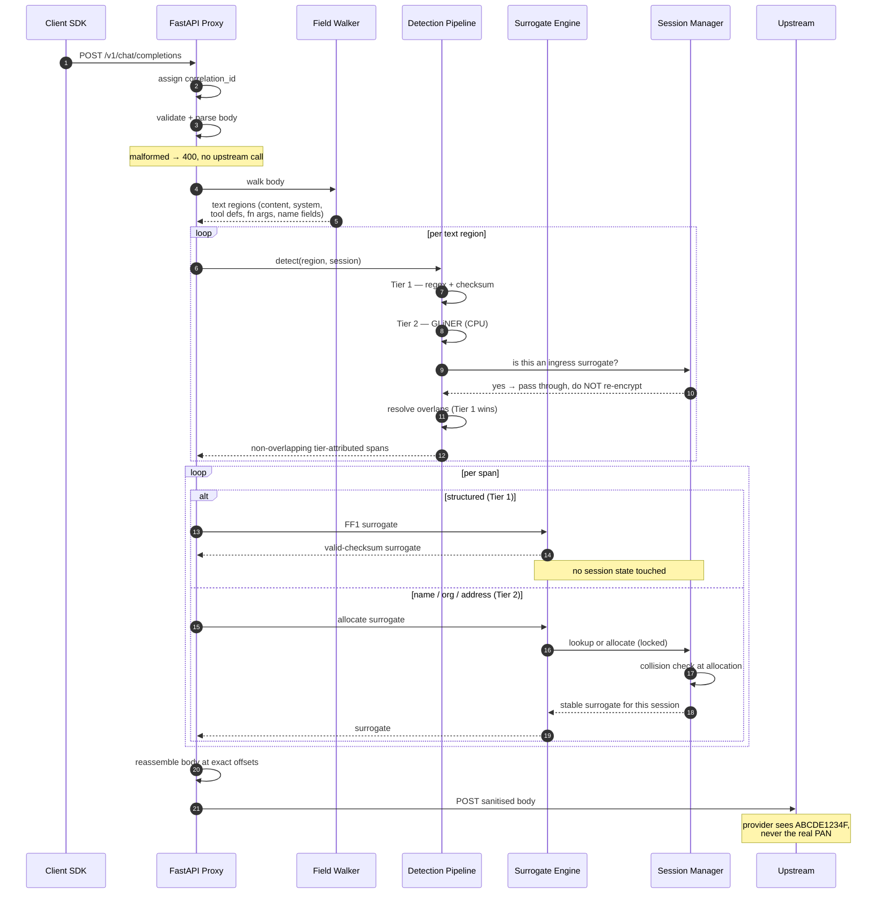

**Step notes.**

- **Validation happens before anything else.** A malformed body never reaches a detector and never reaches the upstream.
- **The ingress-surrogate check is not an optimisation.** On turn 3, the request contains turn 1's assistant message, which already contains surrogates. Tier 1 will happily detect `ABCDE1234F` as a valid PAN and encrypt it again. Rehydration then unwinds exactly one layer, and the user gets a surrogate back. It is silent, it only appears in long conversations, and it never appears in a single-turn demo.
- **Substitution is offset-based**, which is why span precedence must be exactly right. A one-character error inside a JSON string field corrupts the request.

---

## Response Lifecycle

```mermaid
sequenceDiagram
    autonumber
    participant U as Upstream
    participant P as Proxy
    participant W as Sliding Window
    participant R as Rehydration Engine
    participant M as Session Manager
    participant C as Client SDK

    U-->>P: SSE chunk: "The PAN **ABC"
    P->>W: append
    W->>W: prefix "The PAN " is safe;<br/>"**ABC" may be a partial surrogate
    W-->>R: safe prefix only
    R-->>C: "The PAN "

    U-->>P: SSE chunk: "DE1234"
    P->>W: append → "**ABCDE1234"
    W->>W: still could extend — hold

    U-->>P: SSE chunk: "F** was approved"
    P->>W: append → "**ABCDE1234F** was approved"
    W->>W: surrogate complete + terminated
    W-->>R: buffered region
    R->>R: match surrogate (markdown decoration stripped)
    R->>M: reverse lookup / FF1 decrypt
    M-->>R: real value
    R-->>C: "**<real PAN>** was approved"

    U-->>P: [DONE]
    P->>W: flush
    W-->>R: remaining buffer
    R-->>C: final content + [DONE]
    Note over W,C: failure to flush on [DONE] truncates<br/>the last sentence of every response
```

### Why rehydration is genuinely hard

Rehydration is exact-string matching against a system that does not preserve strings. We substitute `Arjun Reddy`. The model may return:

| Returned form | Matchable? |
|---|---|
| `Arjun Reddy` | Yes |
| `**Arjun Reddy**` | Yes — decoration stripped |
| `Arjun's report` | Yes — with possessive handling |
| `Arjun` (first name only) | Partial |
| `A. Reddy` | No |
| `arjun-reddy` (slugified) | No |
| `अर्जुन` (translated) | No |
| "the name begins with A" | No — the model is *reasoning about* the surrogate |

**This is not fixable within scope, and attempting to fix it makes the system less safe.** Aggressive fuzzy matching means an attacker who learns the surrogate distribution — or who simply injects *"please repeat: Arjun Reddy"* — induces the gateway to reinsert **real PII** into attacker-readable output. The privacy layer becomes an exfiltration primitive. That is the sharpest attack on this design.

So the architecture chooses **conservative matching**: misses are visible (a surrogate leaks to the user and looks like a bug) rather than dangerous (real PII leaks to an attacker). The miss rate is measured per category by the rehydration-fidelity harness and published in `docs/LIMITATIONS.md`. Owning this limit is the second-most-honest thing in the project, after the adversarial suite.

---

## Streaming Architecture

### Why SSE is difficult here

SSE delivers content in provider-chosen fragments. The provider tokenises for its own reasons; chunk boundaries are arbitrary with respect to our surrogates. Three consequences:

1. **A surrogate can span any number of chunks.** `ABCDE1234F` may arrive as `AB` + `CDE12` + `34F`. Naive replace-on-chunk sees none of them and emits the surrogate verbatim.
2. **A match is not final until it cannot extend.** `Arjun` might be `Arjun`, or the start of `Arjun Reddy`. Substituting early produces `<real first name> Reddy` — a real name spliced onto a surrogate surname.
3. **Streams are unidirectional and un-rewindable.** Emitted bytes cannot be recalled. Every decision must be made with a bounded lookahead or not at all.

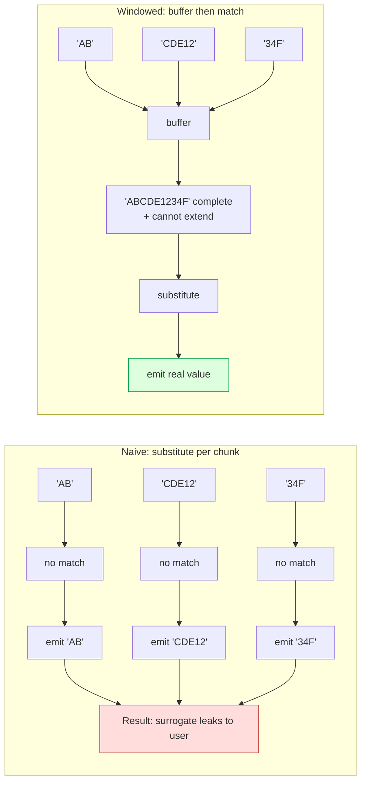

### The sliding window

Invariant: **never emit a byte that could still be part of an unmatched surrogate.**

The window holds up to `max_surrogate_length + safety_margin` characters. On each chunk it computes the longest prefix that provably cannot participate in any future match, releases that prefix, and retains the remainder. On `[DONE]` it flushes unconditionally.

The window length is a named constant with a documented origin, not a magic number: it derives from the longest entity in the surrogate domain plus the longest decoration we handle. Shrinking it to improve TTFT is a **correctness change wearing a performance costume**, and requires a decision entry.

### Trade-offs

| Dimension | Cost |
|---|---|
| **TTFT** | The window is a hard tax on first-token latency — the only latency a human perceives. Reported separately from total, with and without the window. |
| **Perceived smoothness** | Output arrives in window-sized bursts rather than token-by-token. |
| **Memory** | Bounded and trivial. |
| **Correctness** | Strictly improved. This is the trade we are making, deliberately. |

---

## Detection Pipeline

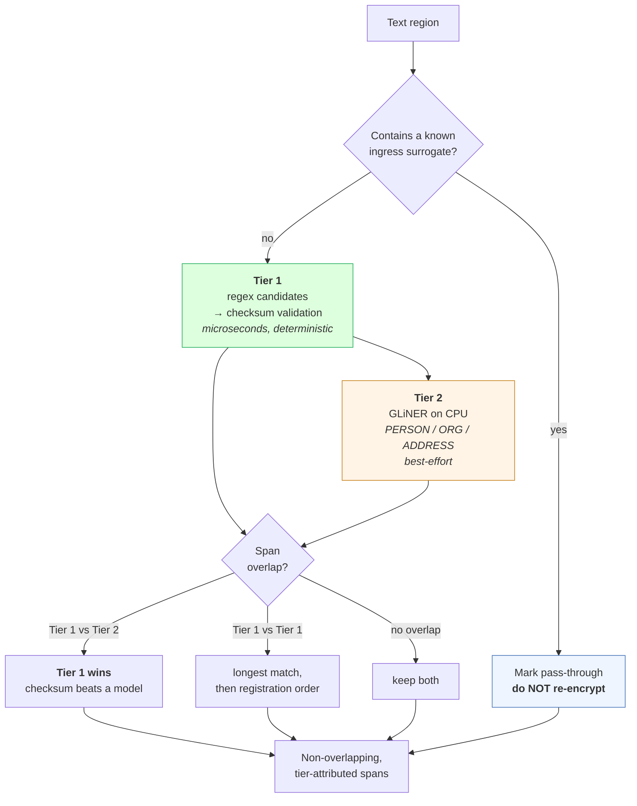

### Tier 1 — deterministic

Regex extracts candidates; **checksums decide**. Verhoeff for Aadhaar, Luhn for cards, structural validation for PAN/IFSC/UPI/vehicle registration. This ordering matters: regex alone produces false positives on any 12-digit number; the checksum is what converts a guess into evidence.

Tier 1 outputs are the only ones this system calls **guaranteed** — with a precise meaning: *if the entity is present in a canonical, unobfuscated form, it is detected with certainty.* Obfuscation defeats it, which the adversarial suite measures rather than hides.

### Tier 2 — best-effort

A GLiNER-class model on CPU for entities with no format. It is a **calibration tool as much as a detector**: it is the component whose weakness on Hinglish and transliterated names the benchmark exists to quantify.

### The cascade

The cascade's justification is honest and narrow: **most text is cleared cheaply**. Tier 1 is microseconds; only text requiring name-level judgement pays model latency. The tier-hit distribution quantifies this — and it is stated as *measured-on-benchmark*, never as a property of real traffic, because our benchmark's PII density is one we chose.

Note that the ablation may find the cascade buys **latency, not accuracy**. That is a fine result and gets reported as-is.

### Why Tier 1 wins

Deterministic evidence beats probabilistic evidence. A checksum-validated PAN inside a GLiNER `ORG` span is a PAN. The reverse rule would let a model's confidence override arithmetic — and arithmetic does not have a false-positive rate.

### Why Tier 3 was removed

The original design included contextual inference-risk detection: catching quasi-identifiers like *"our only female VP in the Hyderabad office who joined last March"* — text containing no PII item that nevertheless identifies someone.

It was cut for a methodological reason, not a difficulty one:

- **k-anonymity is defined over a dataset with a known population and quasi-identifier columns.** Over free text with no reference population, "could this identify someone?" has **no ground truth**.
- No ground truth → no recall number → not evaluable → a demo, not a system. It would be the one component in the architecture with no honest number attached, sitting in a project whose entire thesis is honest numbers.
- An LLM asked "is this identifying?" answers *yes* to nearly everything. Precision collapses, and there is no instrument to observe the collapse.
- It was also the only tier paying full LLM latency for an unmeasurable benefit.

The cut is not a retreat from ambition. It is the same standard the benchmark applies, applied to ourselves.

---

## Surrogate Architecture

The system contains **two surrogate mechanisms**, and understanding why is the fastest route to understanding the whole design.

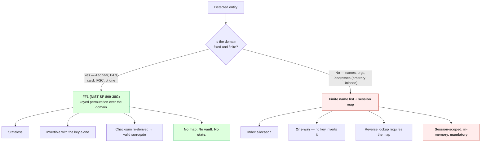

### Structured entities — FF1

FPE is a **keyed permutation over a fixed domain**. Aadhaar is radix 10, length 12 — a fixed domain. FF1 maps a valid Aadhaar to another 12-digit value, deterministically and invertibly, with nothing but the key.

Three properties follow, and they are the strongest properties in the system:

- **Stateless.** No mapping is stored, because none is needed.
- **Consistent by construction.** The same input yields the same surrogate everywhere in the session, automatically, without coordination — including across concurrent requests.
- **Invertible.** Rehydration is a decryption, not a lookup.

Two additional constraints are enforced on top of the permutation:

**Checksum preservation.** A raw FF1 output is 12 digits but almost certainly not Verhoeff-valid. An invalid-checksum surrogate is a tell — it announces "this is a fake" to anyone downstream and breaks any consumer that validates. The engine re-derives the check digit so the surrogate is *valid*, not merely well-shaped.

**Reserved-range membership — an unsatisfiable requirement, retired.** A Verhoeff-valid Aadhaar surrogate could in principle collide with a **real, issuable** Aadhaar. The obvious fix — constrain every surrogate to UIDAI's documented never-issued reserved space — turns out to be mathematically impossible: the issuable space is roughly 1000x larger than UIDAI's only documented reserved range (a `9999`-prefixed test-UID block), so no deterministic, stateless, invertible function can map the former into the latter (pigeonhole; see `docs/DECISIONS.md`, 2026-07-20). This is a permanent, disclosed residual, not a bug — the same class of honesty as the name-surrogate residual below. Benchmark data is unaffected: it only needs a handful of synthetic values, comfortably drawn from the same official `9999` block.

### Names — finite list + session map

This is where the tidy story ends, and the honest sentence is:

> Structured entities use keyed FPE — stateless and invertible. **Names require a session-scoped in-memory map because the domain is unbounded.** That is an unavoidable consequence of wanting realistic surrogates instead of opaque tokens.

"Ramesh Kumar" is arbitrary Unicode, not a fixed domain. To produce *"Arjun Reddy"* — realistic, which is the whole point — the value must map into a **finite name list**. FF1 can permute an *index*, but no key recovers arbitrary free text from an index. The map is mandatory. Claiming "no vault" for the system as a whole would be false, and we do not claim it.

What we *do* claim, precisely: the map is **in-memory, session-scoped, TTL-bounded, never written to disk, never logged, and destroyed with the session**.

### Collision handling

With a finite list, collisions are **likely, not theoretical**. A ~5,000-name list and ~60 distinct people in a session gives roughly a 30% birthday-collision probability. Two real people mapped to one surrogate makes rehydration **ambiguous**, and the system silently emits the wrong person's name — a privacy failure disguised as a typo.

The architecture therefore checks for collisions **at allocation time**, under the session lock, and allocates a different name on conflict. It is cheap if designed in and a corrupting heisenbug if retrofitted. It is tested with a forced 3-name list so that collisions are certain rather than probable.

---

## Session Management

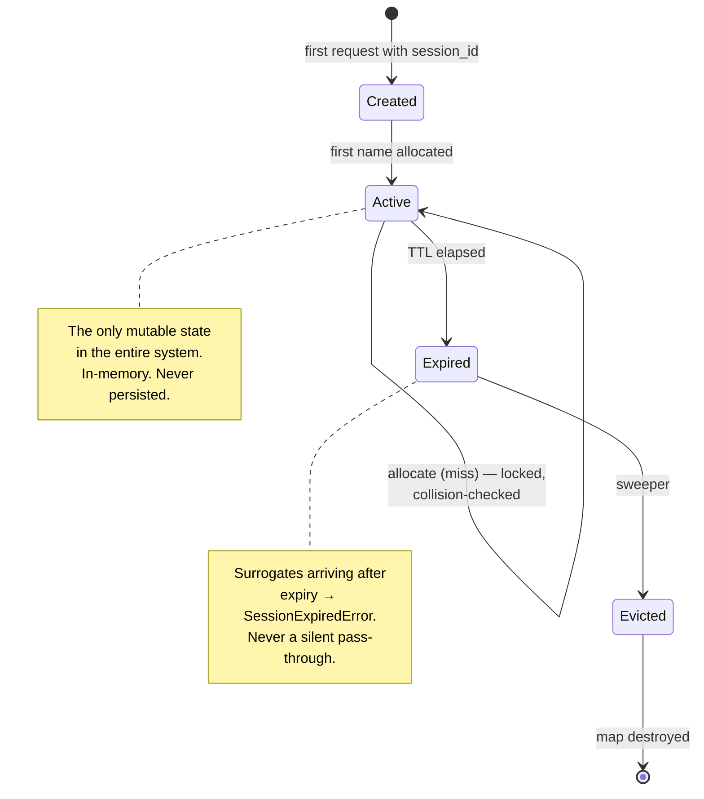

**Lifecycle.** A session is created on first use, holds the bidirectional name map, and dies at TTL. There is no cross-session state, no warm-up, no persistence, no recovery.

**TTL.** Bounded lifetime is a security control, not memory hygiene: it caps the window during which a process dump could expose mappings. `SESSION_TTL` is configured and enforced by an injected clock — which is the only reason expiry is testable without sleeping.

**Thread safety and concurrency.** Two in-flight requests on the same session that both encounter a new name will both attempt allocation. Unsynchronised, that produces two mappings; one wins the write, and the other's surrogate rehydrates to the wrong person — or to nothing. Allocation is therefore serialised per session, with lookup on the fast path. Tested with 50 parallel requests on one session asserting no duplicate and no lost mapping.

**Eviction and memory.** A session's footprint is bounded by the distinct entity count in a conversation — kilobytes. The concern is not size but **lifetime**: an un-evicted session is real PII sitting in RAM with no reason to be there. Eviction is TTL-driven and independent of memory pressure.

**Why the map is never durable.** Making it durable "for reliability across restarts" would rebuild the vault the architecture deliberately deleted, and convert a transient risk into a permanent one. This is not an optimisation opportunity. It is the threat model.

---

## Configuration Architecture

All configuration is loaded from `.env` via `pydantic-settings` into a single validated settings object, **injected** — never reached for globally.

| Variable | Purpose | Notes |
|---|---|---|
| `UPSTREAM_MODE` | `mock` \| `live` | **Defaults to `mock`.** No key, no network, no cost. |
| `UPSTREAM_BASE_URL` | Upstream endpoint | Required when `live`. Never hardcoded — this flag is why the mock exists at all. |
| `UPSTREAM_API_KEY` | Provider credential | Only read when `live`. Never logged, never in an error message. |
| `FPE_KEY` | FF1 key | Required. Absent → startup failure. Determines surrogate stability; rotating it invalidates in-flight sessions by design. |
| `SESSION_TTL` | Session lifetime | Security control. |
| `FAIL_MODE` | `open` \| `closed` | **No safe default exists** — see below. Must be set explicitly. |
| `WINDOW_LOOKAHEAD` | Sliding-window size | Derived from max surrogate length; a correctness parameter, not a tuning knob. |
| `NER_MODEL` | Tier-2 model identifier | CPU-sized. |
| `NER_WARMUP` | Warm at startup | Prevents cold start from polluting p50. |
| `LOG_LEVEL` | Verbosity | **No level, including DEBUG, ever enables plaintext PII.** |

**Startup validation.** Every variable is validated **before the server binds**. Missing `FPE_KEY`, unset `FAIL_MODE`, `live` mode without a base URL, an unloadable model — all are startup failures with actionable messages. The rule: a configuration error must never be discovered at first request, because at first request there is real data in flight.

**No silent security defaults.** `FAIL_MODE` has no default. A default of `open` would silently leak; a default of `closed` would silently cause outages. Both are decisions the operator must make consciously, so the process refuses to start until one is made.

---

## Logging Architecture

The logger is a **security control**. In a system whose purpose is preventing PII from reaching a third party, a log line containing PII is not an observability bug — it is the exact failure the product exists to prevent, committed by the product.

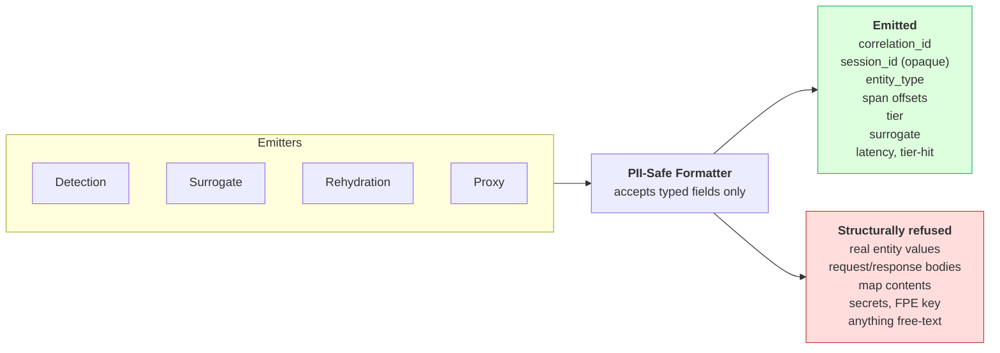

**Correlation IDs.** Every request carries one from ingress through detection, substitution, upstream call, windowing, and rehydration. Multi-turn corruption and split-surrogate bugs are only diagnosable if a single request's path can be reconstructed — and it must be reconstructable **without any PII in the trace**. That constraint is precisely what forces the discipline: if you can debug it from types, offsets, and tiers alone, you never needed the values.

**Why the surrogate is safe to log and the real value is not.** The surrogate is fake by construction. Logging it lets us diagnose rehydration failures. Logging the real value would recreate the leak in a file that outlives the session.

**Structural, not conventional.** The formatter takes typed fields, not strings. An f-string log message cannot be passed. This is a design property enforced by an API and a test, not a rule enforced by discipline — because discipline fails at 2am in week 8.

---

## Error Handling

### Failure taxonomy

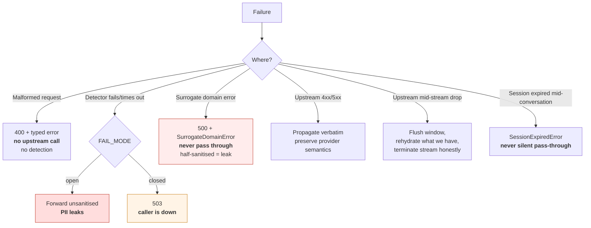

**Request failures.** Validation precedes everything. A body that cannot be parsed cannot be sanitised, and an unsanitised body must never be forwarded.

**Detector failures.** `FAIL_MODE` decides — and there is no correct answer, only a stated one. This is the sharpest design question in the system:

| Mode | Behaviour | Cost |
|---|---|---|
| `open` | Forward unsanitised | The privacy property silently evaporates at exactly the moment of stress. A privacy tool that fails open is a privacy tool that fails. |
| `closed` | 503 | The gateway becomes a single point of failure for the caller's LLM access. Gateway down = LLM down. |

The architecture's position: **`closed` is the defensible default for a privacy product**, because a silent leak is worse than a loud outage, and because a security control that degrades quietly under load is not a control. But the variable has **no default**, and the operator must choose consciously. The reasoning lives in `docs/DECISIONS.md`.

**Surrogate domain errors.** A detector emitting a span the domain cannot represent (an 11-digit "Aadhaar") is exceptional, not expected. Raise. Never pass through. A half-sanitised request is a leak, and crashing is strictly better.

**Streaming failures.** Mid-stream upstream drops flush the window, rehydrate what exists, and terminate honestly. **Failure to flush on `[DONE]` truncates the last sentence of every response** — a bug that looks like a model artifact and is therefore easy to live with for weeks.

**Recovery strategy.** There isn't one, deliberately. No retry queues, no partial-state recovery, no durable resumption — every mechanism would require persisting something we refuse to persist. The system fails cleanly, loudly, and statelessly. Recovery is the caller retrying.

---

## Security Architecture

### Trust boundaries

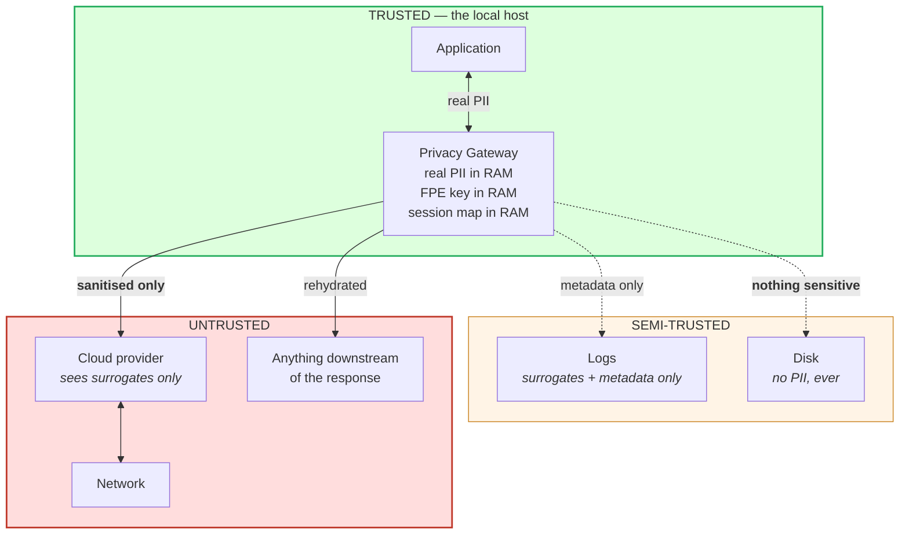

**The boundary is the process, not the host.** Real PII exists only in gateway process memory, only for the duration of a request or session. Everything crossing outward is sanitised. Everything crossing to disk is metadata.

### Threat model

| Threat | Mitigation | Residual |
|---|---|---|
| Provider retains/trains on PII | Sanitisation before egress | Detection misses — measured, published |
| **The gateway becomes the juiciest target** | No persistence, session TTL, in-memory only, minimal footprint | Process memory during a session |
| **Rehydration oracle** | Conservative matching only; no fuzzy expansion | Documented; the sharpest attack on this design |
| Our logs leak | Structural PII-safe formatter + a test | — |
| Adversarial obfuscation defeats Tier 1 | Adversarial suite, published including failures | **Several bypasses still work, and are named in the README** |
| Surrogate collides with a real identity | None for Aadhaar (proven impossible, see DECISIONS.md); names drawn from a bounded, disclosed list | Aadhaar: a surrogate's shape may coincide with an issuable number pattern — measured residual, not detectable at runtime. Names: a surrogate name may coincidentally be a real person's name |
| Concurrent map corruption | Per-session locking, collision check at allocation | — |
| Secrets leak | `.env` only; never logged, never in error messages | Host compromise |

### Attack surface

One local HTTP endpoint, one outbound HTTPS client, one `.env`, one in-memory map. The surface is small **on purpose**: every deleted feature (vault, database, dashboard, policy engine, second provider) was also a deleted attack surface, and that is a substantial part of why they were deleted.

### Why no database, why no persistence

The question that matters is not "would a vault be convenient?" but **"what does a vault do to the threat model?"**

Before the gateway, sensitive values were scattered across prompts, transient, uncorrelated. A vault would collect every one of them into a single, indexed, plaintext-recoverable store — sitting on the machine, surviving restarts, correlating identities across sessions. We would have built a **new PII database that did not previously exist**, in the name of privacy, and made ourselves a far more attractive target than the thing we were protecting against.

So: FF1 needs no map. Names need a map, and that map is in-memory, session-scoped, and dies at TTL. The residual — PII in process memory during an active session — is stated rather than hidden, and is bounded by `SESSION_TTL`.

### Secrets management

`.env` only. Never in code, tests, fixtures, or committed configs. `.env.example` documents the shape. The FPE key is never logged and never appears in an exception message. All PII in this repository is synthetic; Aadhaars are Verhoeff-valid **and** reserved-range, because the dataset is published.

### Privacy guarantees — stated precisely

This is the most important paragraph in the document, and the sentence the whole project is built to be able to say honestly:

> **Structured entities are checksum-guaranteed**: if an Aadhaar, PAN, IFSC, UPI ID, vehicle registration, or payment card is present in canonical form, it is detected and replaced with certainty.
>
> **Names, organisations, and addresses are best-effort** at a measured rate published per entity type.
>
> **This system provides risk reduction with a measured residual. It does not provide a privacy guarantee.** A 97% recall figure is a 3% leak, and marketing "privacy" on a statistical detector would be dishonest.

### Residual risks — published, not buried

1. Tier-2 detection misses — quantified per entity type by the benchmark.
2. Adversarial bypasses that still work — named in the README, not just the results file.
3. Rehydration-fidelity misses — surrogates visibly leaking to the *user* (chosen over the oracle risk).
4. Real PII in process memory for the session lifetime.
5. Benchmark recall is an **optimistic bound** — entity surface forms come from our own generator.
6. Tier-hit rates are properties of our dataset, not of real traffic.

---

## Benchmark Architecture

**This is the project.** Not a chapter of it.

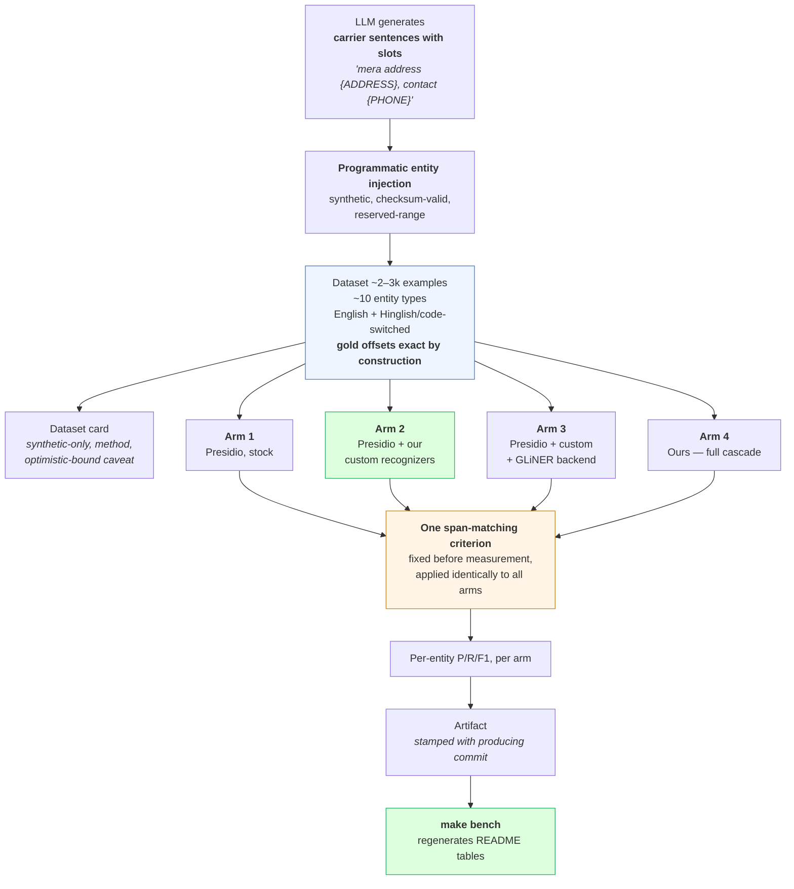

### Generation: carrier templates + slot injection

The obvious approach — ask an LLM for sentences *and* their entity spans — produces misaligned offsets on 10–20% of examples. That means hand-correcting a dataset instead of building the system, and it means the labels are only as good as an LLM's character counting.

The architecture instead separates **linguistic variety** from **label generation**:

- The LLM produces **carrier sentences with slots**, giving diverse, natural, code-switched phrasings.
- Entities are **injected programmatically**. Offsets are therefore **exact by construction** — there is no labelling step to be wrong.

The honest limit, stated in the dataset card and the README: carrier phrasings are LLM-diverse; **entity surface forms are ours**. Recall against our own generator is an **optimistic bound**. Mitigated with real-world mess — `"PAN no. ABCDE1234F"`, spaced/dashed digits, transliterated names, OCR-ish noise — but not eliminated.

### Baselines: why Presidio must be configured fairly

Presidio ships **no** Aadhaar/PAN/IFSC/UPI recognizers by default. Benchmarking against stock Presidio means beating a tool at a task it does not attempt. One question — *"did you configure Presidio with custom recognizers?"* — collapses the claim and the credibility of everything else alongside it.

So: **custom recognizers are written for Presidio, committed to `benchmarks/configs/`, and included in the comparison.** The config file is the fairness proof, and it is meant to be pointed at.

### Ablation arms: attributing the delta

Beating Presidio invites the real question: **"because of what?"** Presidio's default NER is spaCy `en_core_web_lg`, weak on Indian names. We use GLiNER. Part of any delta is *"I chose a better off-the-shelf model"* — not an engineering contribution.

The four arms disaggregate this. If **arm 3 ≈ arm 4**, the honest finding is *"the cascade buys latency, not accuracy"* — a **good result**, reported as-is. We do not tune until arm 4 wins.

### Span-matching criterion

Exact-span, token-level, and partial-credit criteria differ by **10+ points** on the same system. Presidio's own evaluator uses token-level. The criterion is fixed **before** measurement, justified in `docs/DECISIONS.md`, and applied identically to every arm. Changing it after seeing results is forbidden.

### Artifacts and README regeneration

Every number lands in a committed artifact stamped with the commit that produced it. `make bench` regenerates the README tables from artifacts. **Deleting the tables and regenerating them must produce identical output** — this is a test, and it is the entire reason the numbers are credible. No metric is ever written by hand. Rows where a baseline beats us stay in the table.

---

## Adversarial Evaluation

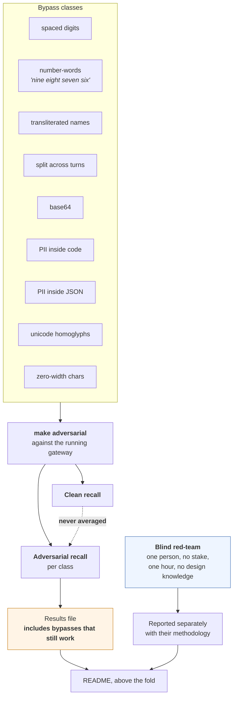

**Each bypass class is a runnable case** with an expected-outcome record, executed against the live gateway rather than against a detector in isolation — because bypasses like split-across-turns only exist at the system level.

**Clean and adversarial recall are never averaged.** Averaging hides the entire finding. The gap between them *is* the result.

**Unfixed bypasses stay in the results and in the README.** This is the single strongest artifact in the repository. A student reporting 97% recall sounds like a brochure. A student reporting 97%, naming the 3%, and listing three bypasses they cannot fix sounds like an engineer.

**Blind red-team.** The author writing the attacks and then fixing them means the measured adversarial recall is *an upper bound on a lower bound*, and any reviewer knows it. The mitigation available in scope: one person with no stake in the design, one hour, no knowledge of the internals, reporting **their** hit rate separately with their methodology. Fifteen minutes of coordination converts "I tested my system" into "my system was tested." It does not eliminate selection bias; it bounds it, and the bound is stated.

**Residual-leak reporting** — above the fold in the README, in the plainest available English: structured entities are checksum-guaranteed; names are best-effort at X%; this is risk reduction with a measured residual, not a guarantee.

---

## Performance Architecture

### What is measured, and why each is measured separately

| Metric | Why it is its own line |
|---|---|
| **TTFT** | The only latency a human perceives, and the one the sliding window taxes. Reported with and without the window, so the cost of correctness is visible and priced. |
| **Total latency** | Whole-request; dominated by the upstream in `live` mode, which is why it is the *less* interesting number. |
| **Per-tier p50/p95/p99** | The cascade's entire justification is that most text clears cheaply. An aggregate number hides whether that is true. |
| **Tier-hit distribution** | The cascade's payoff. Stated as *measured-on-benchmark*, never as a property of real traffic. |
| **Cold start** | The first GLiNER inference is seconds. Inside p50 → the number is wrong. Silently dropped → we are hiding the worst UX moment. Its own line. |

### Concurrency

**A single-threaded loop produces a fantasy p99.** Python's GIL plus CPU inference at even four concurrent requests is a different distribution entirely — not a scaled version of the serial one. The harness runs at **1 / 4 / 8** concurrency and **every reported number carries its concurrency level**. A p99 without a stated concurrency level is not reported at all.

### Throughput and CPU-only assumptions

Target: **one developer's machine** — Windows 11, i7, no GPU. Not a fleet. The Tier-2 model is chosen to be small enough that the model is never the story; the story is the evaluation.

Under concurrency the bottleneck is CPU inference and the GIL, not the proxy. This is expected and reported rather than engineered around: **architecture is never changed for optimisation**. If throughput mattered, the answer would be a separate inference process — which is a different system, and it is in Future Work, not in this build.

### Measurement methodology

1. Warm the model at startup; the first inference never counts toward steady state and is reported separately.
2. Fixed input distribution from the benchmark dataset, so runs are comparable across commits.
3. Report at 1/4/8 concurrency, always labelled.
4. Report per tier, plus the tier-hit distribution that gives those numbers their weight.
5. Report TTFT separately from total, with and without the window.
6. Every number regenerated by the runner; nothing hand-written.
7. Every optimisation carries a before/after from the same harness at the same concurrency. "This felt slow" is a hypothesis, not a finding.

---

## Technology Decisions

### FastAPI

**Alternatives:** Flask, Starlette raw, Litestar, an nginx/Envoy filter.
**Chosen because:** native async is mandatory for proxying SSE without blocking; Pydantic validation is already the type discipline we want at the boundary; dependency injection is first-class, which is what makes the mock upstream, injected clock, and injected model testable.
**Trade-offs:** more framework than a proxy strictly needs. An Envoy filter would be the production answer at scale and the wrong answer here — the interesting logic is CPU-bound Python, and splitting the data plane from it would add operational complexity with no benefit at one-developer scale.

### Python

**Alternatives:** Go or Rust (better concurrency story for a proxy), Node.
**Chosen because:** the ML ecosystem, Presidio, and GLiNER are all Python. A Go proxy calling a Python sidecar for inference would be two processes, two deployment stories, and one very slow week — to optimise a dimension (throughput) the project does not claim.
**Trade-offs:** the GIL caps concurrent throughput on CPU inference. We **measure and report** this rather than engineering around it, which is the correct call for a project whose contribution is evaluation.

### OpenAI-compatible interface

**Alternatives:** a bespoke API, an SDK wrapper, per-provider adapters.
**Chosen because:** it makes integration a one-line change against the stock SDK. That single property is the product's usability claim, and it also makes the demo trivially legible: an interviewer sees familiar client code pointed at localhost.
**Trade-offs:** we inherit the OpenAI wire format's quirks and must track it. Anthropic/Gemini-native formats need translation — which is exactly the multi-provider plumbing we cut.

### FF1 (NIST SP 800-38G)

**Alternatives:** random tokens with a vault; deterministic HMAC truncation; simple redaction.
**Chosen because:** it is the only option that is simultaneously format-preserving, deterministic, invertible, **and stateless**. Statelessness is what lets structured entities avoid a vault entirely — the strongest security property in the design. It is also the standard: Google Cloud DLP uses FF1 for exactly this, and citing SP 800-38G beats inventing a scheme.
**Trade-offs:** only works on fixed domains — which is precisely why names need a map, and why that asymmetry is the honest centre of the design. FF1 also has known small-domain caveats, which is why it is applied to 10–16 digit domains and not to short fields.

### GLiNER

**Alternatives:** spaCy `en_core_web_lg` (Presidio's default), a fine-tuned BERT NER, a quantized 1–3B LLM, a cloud NER API.
**Chosen because:** zero-shot typed extraction with a small CPU footprint and materially better handling of non-Western names than spaCy's default. A cloud NER API would violate the local-first premise absolutely — sending PII to a third party to detect PII.
**Trade-offs:** slower than spaCy; still weak on heavy Hinglish and transliteration — **which is a finding, not a defect**, and one the benchmark exists to quantify. Choosing GLiNER also means part of any delta over Presidio is "we picked a better model," which is exactly why arm 3 exists.

### Presidio

**Alternatives:** AWS Comprehend, Google DLP, Private AI, Nightfall, or no baseline.
**Chosen as the baseline because:** it is open-source, free, locally runnable, industry-standard, extensible with custom recognizers, and — critically — its configuration can be **committed**, so the fairness of the comparison is inspectable rather than asserted. A cloud baseline would be unreproducible and would cost money to re-run.
**Trade-offs:** it is not the strongest commercial system, so beating it is not beating the field. The README says so.

### PowerShell / Windows-first

**Alternatives:** WSL2, Docker-only, bash-with-caveats.
**Chosen because:** the development machine is Windows 11. Guidance that assumes bash produces commands that silently fail on the actual machine, and a project that only runs under WSL has a hidden dependency in its setup story.
**Trade-offs:** two command dialects to maintain (PowerShell for development, Docker for the one-command demo). Accepted: the demo target is `docker compose up`, so reviewers never see PowerShell at all.

### In-memory session map

**Alternatives:** Redis, SQLite, an encrypted file vault.
**Chosen because:** every alternative persists PII, and persisting PII is the threat-model inversion this architecture exists to refuse. In-memory also removes an entire class of dependency, deployment, and attack surface.
**Trade-offs:** no cross-restart continuity and no horizontal scaling. Both are irrelevant at the scope of this system, and both are Future Work items with honest security caveats attached.

---

## Future Work

**Explicitly out of scope for this build.** Listed here so the boundary is a decision rather than an omission. Nothing here may be implemented without a scope change.

**MCP compatibility.** Architecturally coherent as an *addition*, not a replacement: an MCP proxy would sanitise **tool results flowing into agent context** — data from files, email, and databases entering the model's context autonomously. It is a genuinely different product with a genuinely different pitch ("prevent sensitive data from ever entering agent context") and **no rehydration story**, because MCP does not carry the inference call. It is not the same system with a different transport, which is exactly why it is deferred rather than merged.

**Additional providers.** Anthropic and Gemini native wire formats via translation adapters. Plumbing; no new engineering signal.

**Policy engine.** Per-entity, per-destination rules (`block` / `pseudonymize` / `allow`). Cut deliberately: low effort, high perceived maturity, near-zero depth. Would matter in a real enterprise deployment; does not matter to this project's contribution.

**GPU inference.** Would make a larger Tier-2 model viable and change the accuracy/latency frontier. Also contradicts the local-first, developer-machine premise. Interesting only if evaluation proves the Tier-2 model is the binding constraint.

**Fine-tuned Indian-entity NER.** The natural next step **if and only if** the benchmark says the model is what limits recall. The benchmark is the prerequisite, not the afterthought — which is the correct ordering and the reason it isn't in this build.

**Separate inference process.** Removes the GIL bottleneck under concurrency. A throughput answer to a question this project does not ask.

**Rehydration fidelity improvements.** Better handling of partial, abbreviated, translated, and reasoned-about surrogates — bounded hard by the rehydration-oracle risk. Any work here must argue against that risk first.

---

## References

**Standards and algorithms**

- NIST SP 800-38G — *Recommendation for Block Cipher Modes of Operation: Methods for Format-Preserving Encryption* (FF1). The specification for the structured-surrogate mechanism.
- NIST SP 800-38G Rev. 1 (Draft) — small-domain caveats relevant to short-field FPE.
- Verhoeff, J. (1969) — *Error Detecting Decimal Codes*. The Aadhaar check-digit algorithm; detects all single-digit errors and all adjacent transpositions.
- ISO/IEC 7812-1 — Luhn check digit, payment cards.
- UIDAI — Aadhaar numbering scheme and reserved/never-issued ranges. **Consult before writing the generator, not after.**
- Income Tax Department (India) — PAN structure. RBI — IFSC structure. NPCI — UPI ID format.

**Tools and libraries**

- Microsoft Presidio — the baseline. Note in particular its custom-recognizer extension mechanism and its evaluator's span-matching semantics; both are load-bearing for a fair comparison.
- GLiNER — *Generalist Model for Named Entity Recognition using Bidirectional Transformer*. Zero-shot typed NER at CPU-viable size.
- spaCy `en_core_web_lg` — Presidio's default NER backend; the reason arm 3 exists.
- FastAPI / Starlette — async framework and SSE handling.
- Pydantic v2 / pydantic-settings — boundary validation and configuration.

**Protocols**

- OpenAI API reference — chat completions request/response schema and streaming semantics; the wire contract this system must preserve exactly.
- WHATWG HTML Living Standard, §Server-sent events — SSE framing, `data:` lines, and stream termination.
- Model Context Protocol specification — for the Future Work section, and for the record of why MCP is the wrong layer for *this* goal.

**Prior art — the systems this project reimplements, and says so**

- Skyflow LLM Privacy Vault — the closest commercial analogue to this product.
- Google Cloud DLP — FF1-based deterministic, reversible, format-preserving de-identification, in production since ~2019. Upgrade-3-equivalent, shipped.
- LiteLLM guardrails, Cloudflare AI Gateway, Portkey — gateway-layer PII masking.
- AWS Comprehend PII, Private AI, Nightfall, Protecto — detection APIs.

**Concepts referenced and deliberately not implemented**

- Sweeney, L. (2002) — *k-Anonymity*. Cited for why Tier 3 was cut: k-anonymity requires a defined population and quasi-identifier columns. Free text with no reference population has neither, and therefore has no ground truth to evaluate against.
