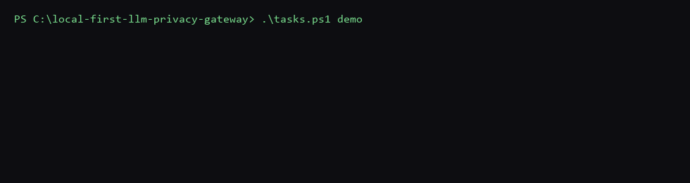

# Local-First LLM Privacy Gateway

A local-first egress proxy that sits between your application and a cloud LLM
provider. It exposes an OpenAI-compatible `/v1/chat/completions` surface,
inspects every outbound request body, replaces sensitive entities (Aadhaar,
PAN, card numbers, names, addresses, and more) with realistic,
format-preserving surrogates before anything leaves the machine, and
rehydrates the streaming response so your application sees the real values.
The provider sees `ABCDE1234F`. Your application sees the real PAN. Neither
side notices the proxy.

```python
from openai import OpenAI

client = OpenAI(base_url="http://localhost:8080/v1", api_key="not-needed")
```

That's the entire integration — one line changes, prompts stop leaking. This
is a competent reimplementation of a pattern already shipped in production by
Skyflow, Google Cloud DLP, and others (full list and framing in
[Competitor comparison](#competitor-comparison)) — not a novel gateway
architecture. What this repository contributes instead is two evaluation
artifacts that don't otherwise exist: a fairly-baselined Indian-PII detection
benchmark, and an adversarial bypass suite that reports the bypasses that
still work. Every number below is regenerated from a committed artifact by a
runner in this repository — nothing here is hand-typed.

## Demo



Every command, log line, and response above is real — captured from an
actual `docker compose up --build` run and an actual request against the
running gateway (a synthetic, Verhoeff-valid Aadhaar from the UIDAI
reserved test range, `999910433219`, and a synthetic name, "Zara Arora,"
neither belonging to a real person). It is **not** a raw screen recording:
it's a small script that renders the real, verbatim captured text (the
container startup, the request, the gateway's own detection/substitution
log lines, what the mock upstream actually received, and the rehydrated
response) as a paced terminal-style animation. The content is 100% real;
only the animation's pacing was authored, the same way any edited demo
recording is trimmed. It shows the four things this gateway's whole value
proposition rests on, sequentially rather than in a literal split-screen:
the one-command startup, the request leaving with real PII in it, the
provider-facing side seeing surrogates only, and the caller getting the
real values back.

No screenshots beyond the terminal capture above — this is a CLI/API tool
with no graphical interface to screenshot.

Want to run this yourself instead of watching it? Skip to
[Try it yourself](#try-it-yourself).

## Key features

- **Drop-in OpenAI-compatible proxy** — one `base_url` change, no SDK, no
  wrapper.
- **Two-tier detection cascade** — deterministic checksum/regex (Aadhaar,
  PAN, IFSC, UPI, vehicle registration, card, email, phone) plus a
  GLiNER-class NER model for names, organisations, and addresses.
- **Format-preserving surrogates, not redaction** — FF1 (NIST SP 800-38G)
  keyed encryption for structured entities; a session-scoped name map for
  everything else. The model reasons over realistic-looking data instead of
  `[REDACTED]`.
- **Streaming-safe rehydration** — real values are restored in the response
  correctly across arbitrary SSE chunk boundaries.
- **Zero persistence** — no vault, no database. The one unavoidable piece of
  state (the name map) is in-memory and session-scoped, and dies with the
  session.
- **No real provider API key required** — a bundled mock upstream stands
  in for the cloud LLM provider and is the default and only upstream this
  repository's tests, benchmarks, and demo ever use.
- **Every number reproducible** — detection accuracy, adversarial
  robustness, and latency are each measured by a committed runner, never
  hand-typed into this document.

See [Architecture](#architecture) for how these pieces fit together, or
skip straight to [Try it yourself](#try-it-yourself) to run it.

## Architecture

One OpenAI-compatible surface, a config/flag-driven upstream (mock by
default, a real provider optionally — never hardcoded), a two-tier detection
cascade (Tier 1 wins any overlap with Tier 2; there is no Tier 3), FF1
surrogates for structured entities, and a session-scoped in-memory name map
for everything else. Layering is one-directional: `proxy` → `pipeline` →
`detect`/`surrogate`/`session` → `core`. No database, no policy engine, no
frontend. Full component diagrams, request/response lifecycles, and the
reasoning behind every frozen decision are in
[`ARCHITECTURE.md`](ARCHITECTURE.md).

## Try it yourself

This section is a complete walkthrough — clone, run, and confirm the
project actually works — written for someone who has never touched this
repository before. No API key or account is needed anywhere below.

A **terminal** here means PowerShell on Windows (press the **Start**
button, type `powershell`, press **Enter**). Every command below is typed
into a terminal window and run by pressing **Enter**. When a step says to
open a **new** terminal window, do exactly that — leave whatever is
already running alone, and open a second, separate PowerShell window
(Start → type `powershell` → Enter, again) instead of typing into the
first one.

There are two ways to run the project, compared here so you can pick one
before reading further:

| | **Docker** (recommended) | **Native** |
|---|---|---|
| Best for | Just trying it out, on any OS | Reading/editing the Python code |
| You need installed | [Docker Desktop](https://www.docker.com/products/docker-desktop/) | Python 3.11+ |
| Terminal windows needed | 1, total | 3, total |
| Jump to | [Docker path](#the-docker-path) | [Native path](#the-native-path) |

If you're not sure which to pick, use Docker — it's fewer steps and
works the same way on Windows, macOS, and Linux.

### Clone the repository

Do this once, regardless of which path you pick below. In a terminal
window:

```powershell
git clone https://github.com/Arshanapally-Akshith/local-first-llm-privacy-gateway.git
cd local-first-llm-privacy-gateway
```

**What to expect:** Git prints a few lines about the download, then
returns you to the prompt. You're now "in" the repository folder for
every command that follows — the rest of this walkthrough assumes your
terminal is still in this folder.

### The Docker path

Everything in this path happens in the **one** terminal window you
already have open from the clone step — you will not need to open
another one.

**Step 1 — make sure Docker Desktop is actually running.** Look for the
Docker whale icon in your system tray/menu bar; open the Docker Desktop
application if it isn't already running and wait for it to say it's
ready. (If you skip this, the next command fails immediately with
`docker: cannot connect to the Docker daemon` — that error means exactly
this, not something wrong with this repository.)

**Step 2 — build and start the project**, in the same terminal window:

```powershell
docker compose up --build -d
```

The `-d` flag runs the containers in the background instead of tying up
this window with streaming logs — that's what lets you keep using this
same terminal for every remaining step below.

**What to expect:** several minutes of scrolling build output the first
time you ever run this (it's downloading and installing dependencies,
including a machine-learning model — this is normal, not stuck). When it
finishes, you'll see two lines ending in `Started`, and the command
returns you to your prompt. **First run: roughly 3–4
minutes.** Every run after that reuses what was already downloaded and
takes about 90 seconds.

**Step 3 — confirm both containers are healthy**, same terminal window:

```powershell
docker compose ps
```

**What to expect:** a small table like this — the exact container names
and elapsed time may differ, what matters is the word in parentheses at
the end of `STATUS`:

```
NAME                                              STATUS
local-first-llm-privacy-gateway-gateway-1         Up 8 seconds (healthy)
local-first-llm-privacy-gateway-mock-upstream-1   Up 11 seconds (healthy)
```

If either row says `(health: starting)` instead of `(healthy)`, the
gateway is still loading its detection model — wait about 30 seconds and
run `docker compose ps` again. Once both say `(healthy)`, go to
[Confirm it's actually working](#confirm-its-actually-working) below.

Want to watch the gateway's own logs while it runs, without giving up
this terminal? Run `docker compose logs -f gateway` (`-f` follows the log
continuously; press `Ctrl+C` to stop watching — this does not stop the
container).

**When you're done trying it out**, stop everything with (same window):

```powershell
docker compose down
```

This stops and removes the containers but keeps the downloaded model
cached, so the next `docker compose up --build -d` you ever run is fast
again, not another 3–4 minutes.

<details>
<summary>Prefer to watch the logs live instead of running in the background? Click to expand.</summary>

`.\tasks.ps1 demo` runs the exact same thing as `docker compose up --build`
(no `-d`), except it stays in the foreground and streams both containers'
logs to your terminal continuously. That's useful for watching what's
happening, but it also means that terminal window is now busy — press
`Ctrl+C` to stop it (this also stops the containers), or open a *second*
terminal window if you want to run other commands (like the verification
step below) while it keeps streaming.

</details>

### The Native path

Use this only if you plan to read or edit the Python source directly —
it's more steps than Docker and needs three separate terminal windows by
the end. `tasks.ps1` (the script every command below runs) only works in
Windows PowerShell; on macOS/Linux, use the Docker path instead.

**Step 1 — set up the project**, in the terminal window from the clone
step:

```powershell
python -m venv venv
.\venv\Scripts\Activate.ps1
.\tasks.ps1 install
copy .env.example .env
```

**What to expect:** `Activate.ps1` changes your prompt to start with
`(venv)`; `tasks.ps1 install` prints package-installation output for a
minute or two; `copy` prints nothing on success. All four commands run in
this same, first terminal window.

**Step 2 — start the mock upstream.** Still in this first window:

```powershell
.\tasks.ps1 mock
```

**What to expect:** this prints `Uvicorn running on http://127.0.0.1:8081`
and then **does not return your prompt** — it's now running continuously
in this window. **Leave this window open and untouched** for as long as
you want the project running; every remaining step happens in *other*
windows.

**Step 3 — start the gateway.** Open a **new, second** terminal window
(Start → `powershell` → Enter). In this new window:

```powershell
cd local-first-llm-privacy-gateway
.\venv\Scripts\Activate.ps1
.\tasks.ps1 run
```

(You need `cd` and `Activate.ps1` again here — a new terminal window
starts fresh, in your home folder, without the virtual environment from
Step 1.) **What to expect:** same as Step 2 — it prints `Uvicorn running
on http://127.0.0.1:8080` and then sits there running. **Leave this
second window open too.**

You now have two windows open and running (mock upstream and gateway) and
neither will accept further typing — that's expected. Open a **third**
terminal window for the verification step below.

*Why two long-running processes:* the "mock upstream" stands in for a
real cloud LLM provider (so no API key is ever needed), and the gateway
is the actual privacy proxy sitting in front of it. This native setup is
also what you'd use to edit the code and see changes take effect
immediately (`run`/`mock` both auto-reload on save) — it's unrelated to
the evaluation commands further down this README (`bench`, `adversarial`,
`latency-bench`, `test`, `check`), each of which starts and stops its own
processes on its own and does not need these two windows open at all.

**When you're done**, press `Ctrl+C` in the mock-upstream window and
again in the gateway window to stop both.

### Confirm it's actually working

Whichever path you used, the gateway is now listening at
`http://localhost:8080`. Run this in whichever terminal window is free —
for Docker, that's the same one window; for Native, that's your third
window:

```powershell
$body = @{
    model    = "gpt-4"
    stream   = $false
    messages = @(@{ role = "user"; content = "My Aadhaar is 999910433219." })
} | ConvertTo-Json -Depth 5

Invoke-RestMethod -Uri "http://localhost:8080/v1/chat/completions" -Method Post `
  -Headers @{ "X-Session-Id" = "quickstart-check" } -ContentType "application/json" -Body $body
```

Use `Invoke-RestMethod` exactly as written, not `curl`/`curl.exe` —
PowerShell's argument quoting mangles inline JSON passed to a native
executable's `-d` flag (tested; it produces a malformed request the
gateway rejects). `999910433219` is a synthetic, Verhoeff-valid Aadhaar
number from UIDAI's documented reserved test range — not a real person's,
safe to reuse anywhere.

**What you should see, in order:**

1. **The command prints a response.** Look for `choices` in the output,
   and inside it, `content` — it should read `My Aadhaar is
   999910433219.`, your original input, unchanged from where you're
   sitting.
2. **That alone doesn't prove anything yet** — the mock upstream just
   echoes back whatever content it receives, so this would look identical
   whether or not the gateway actually did anything. The real proof is in
   what the mock upstream says it *received*. Go look:
   - **Docker:** run `docker compose logs mock-upstream` in your one
     terminal window.
   - **Native:** switch to (don't close) your **first** terminal window —
     the one running `.\tasks.ps1 mock` — and read its output directly.
3. **Look for a line like this** in that output:

   ```
   mock upstream received body: {'messages': [{'content': 'My Aadhaar is <a different 12-digit number>.', ...
   ```

4. **Compare the two numbers.** If the number the mock upstream received
   is *different* from `999910433219` (the number you actually sent), the
   gateway detected the real Aadhaar, replaced it with a fake-but-valid
   look-alike before the request ever left your machine, sent *that* to
   the mock provider, and swapped the real number back into the response
   you read in step 1. That detect → replace → restore round trip is the
   entire reason this project exists. The [Demo](#demo) GIF above shows
   the same round trip, with a person's name added too.

**If the two numbers matched** (no substitution happened), something's
misconfigured. Check for a startup error: `docker compose logs gateway`
(Docker), or scroll up in your gateway terminal window (Native) — the
most likely cause is a missing or invalid value in your `.env` file
(Native path only; the Docker path fills these in for you automatically).

## Performance / benchmarks

### Detection accuracy (Phase 5)

Full per-entity precision/recall/F1 for all four ablation arms — stock
Presidio, Presidio with custom Indian-entity recognizers, Presidio+custom+our
GLiNER backend, and our full cascade — is committed at
[`benchmarks/results/latest.md`](benchmarks/results/latest.md), regenerated
by `.\tasks.ps1 bench` from [`benchmarks/data/dataset.jsonl`](benchmarks/data/DATASET_CARD.md)
(2,860 synthetic examples, gold offsets exact by construction). Rows where a
baseline beats our own cascade are not removed.

Headline, quoted directly from that artifact (commit `cb0e7f2`): our full
cascade reaches **1.000 F1 on 8 of 11 entity types** (AADHAAR, CARD, EMAIL,
IFSC, PAN, PHONE, UPI, VEHICLE_REG) and 0.995 on ADDRESS. The two hardest
categories — ORG (0.670 F1) and PERSON (0.828 F1) — are also the hardest for
the *fairly configured* Presidio+GLiNER baseline (arm 3: ORG 0.617, PERSON
0.747): free-text entity recognition in Hinglish/code-switched carrier text is
a genuinely hard problem for both approaches, not something either solves
outright. Stock Presidio (arm 1), which ships no Aadhaar/PAN/IFSC/UPI/vehicle
recognizers at all, scores 0.000 F1 on every one of those five types —
included in the table specifically so beating it isn't mistaken for a fair
comparison; arm 2 (Presidio + our committed custom recognizer config) is the
fair baseline, committed at
[`benchmarks/arms/presidio_custom/`](benchmarks/arms/presidio_custom/).

**Read this as an optimistic bound, not a real-world guarantee**: carrier
sentence phrasing is LLM-generated and diverse, but entity surface forms come
from our own generator — see the
[dataset card](benchmarks/data/DATASET_CARD.md) for the full caveat.

### Latency (Phase 7)

Full per-workload, per-concurrency results (TTFT with and without the
sliding window, total latency, per-tier percentiles, cold start) are
committed at [`latency/results/latest.md`](latency/results/latest.md),
regenerated by `.\tasks.ps1 latency-bench` — a real subprocess gateway and
mock upstream over real sockets, at concurrency levels 1/2/4/8/16, 200
requests per cell, every number stating its own concurrency level.

Headline, quoted directly from that artifact (commit `ab7222a`): **38 of the
40 cells completed with zero timeouts or errors.** Cold start (loading the
Tier-2 model) measured 14.6s–21.8s across 10 independent fresh process
starts. One systematic, disclosed finding, not a bug fixed to look better:
concurrent requests currently serialize on the gateway's single event loop
(`sanitize()` runs synchronously with no thread offload) — visible directly
in the numbers, e.g. the zero-PII baseline workload's mean TTFT goes from
~1.06s at concurrency=1 to ~12.0s at concurrency=16, and at the extreme this
pushed the gateway's own upstream-client timeout past its limit for one
workload (`multiturn_5`, the two non-clean cells, at concurrency 8 and 16).
Reported as measured; not optimized away — see
[`docs/PHASE_7_SUMMARY.md`](docs/PHASE_7_SUMMARY.md) for the full
investigation.

## Security & privacy guarantees

> **Structured entities are checksum-guaranteed**: if an Aadhaar, PAN, IFSC,
> UPI ID, vehicle registration, or payment card is present in canonical form,
> it is detected and replaced with certainty.
>
> **Names, organisations, and addresses are best-effort**, at the measured
> rate in the [detection accuracy](#detection-accuracy-phase-5) table above.
>
> **This system provides risk reduction with a measured residual. It does
> not provide a privacy guarantee.** A recall figure below 100% is a leak at
> that rate, and marketing "privacy" on top of a statistical detector would
> be dishonest. Full statement in
> [`ARCHITECTURE.md`](ARCHITECTURE.md#privacy-guarantees--stated-precisely).

### Adversarial bypass suite (Phase 6)

Full results, per bypass class, are committed at
[`adversarial/results/latest.md`](adversarial/results/latest.md),
regenerated by `.\tasks.ps1 adversarial` against the real, running gateway —
not against the detector in isolation. Clean and adversarial recall are
reported separately per class and never averaged.

Headline, quoted directly from that artifact (commit `e47a030`, 42 cases
across 9 bypass classes): **8 of 9 classes measured 0% adversarial recall**
(100% leak rate) on every entity type they were tested against — base64
encoding, number-words, spaced digits, Unicode homoglyphs, zero-width
characters, PII embedded in code, PII used as a JSON key, and PII split
across conversation turns. **19 specific bypasses are still unfixed today**,
named individually — case id and entity type — in the "Bypasses that still
work" section of the artifact above; none are hidden or removed. The ninth
class, transliterated Devanagari-script names, measured 100% recall — a
result that *contradicted* this project's own prediction (a Hinglish/
romanization weakness was expected to leak), reported here as a genuine
prediction mismatch rather than adjusted after the fact.

A blind red-team exercise (a person with no stake in the design, attacking
the running gateway for about an hour) has a harness and recording template
at [`adversarial/redteam/INSTRUCTIONS.md`](adversarial/redteam/INSTRUCTIONS.md)
but **has not been run yet** — see
[`adversarial/results/redteam.md`](adversarial/results/redteam.md), marked
"NOT YET RUN."

## Threat model

Full trust-boundary diagram, threat table, and reasoning in
[`ARCHITECTURE.md`](ARCHITECTURE.md#security-architecture). Summarized here:

**Why isn't the proxy the new juiciest target?** It holds no persistent
store. Real PII exists only in gateway process memory, only for the duration
of a request or an active session (bounded by `SESSION_TTL`). There is
nothing on disk to steal, and nothing to steal after the process exits.

**Fail-open vs. fail-closed.** `FAIL_MODE` has no default — the operator
must choose explicitly. This project's own position: **fail-closed is the
defensible default for a privacy product.** A detector failure under `open`
silently forwards unsanitised data — the privacy property evaporates exactly
when the system is under stress. A security control that degrades quietly is
not a control. `closed` returns a 503 instead: a loud outage, not a silent
leak.

**The rehydration-oracle tradeoff.** Rehydration only ever matches an exact,
contiguous surrogate string — never fuzzy, never partial. Aggressive fuzzy
matching would let an attacker who learns the surrogate distribution (or who
simply asks the model to repeat a name) induce the gateway into reinserting
*real* PII into attacker-readable output, turning the privacy layer into an
exfiltration primitive. This project accepts the alternative cost instead:
visible misses, where an unrehydrated surrogate leaks to the legitimate user
and looks like a bug. Measured per category in
[`docs/LIMITATIONS.md`](docs/LIMITATIONS.md).

**Why there's no vault, and why the Tier-2 session map is unavoidable.** A
persistent map of real-to-surrogate values would concentrate every sensitive
value a user ever sent into one indexed, plaintext-recoverable store — a
threat-model inversion, building the exact database this project exists to
avoid creating. Structured entities (Aadhaar, PAN, card numbers, ...) use
keyed FF1 encryption and need no map at all: the same key that encrypted a
value can decrypt it, statelessly. Names, organisations, and addresses are
arbitrary Unicode with no fixed domain FF1 can permute over — producing a
*realistic* surrogate (not an opaque token) requires mapping into a finite
candidate list, and that map is the one piece of state this system cannot
avoid. It is in-memory, session-scoped, and dies at `SESSION_TTL` or process
exit — never written to disk, never logged.

## Competitor comparison

The gateway pattern — reversible, format-preserving pseudonymisation between
an application and an LLM — is solved and shipped in production today:

- **Skyflow** (LLM Privacy Vault)
- **Google Cloud DLP** (FF1-based deterministic surrogates, reversible,
  production since ~2019)
- **LiteLLM guardrails**
- **Cloudflare AI Gateway**
- **Portkey**
- **Microsoft Presidio** (the detection library this project's own benchmark
  baselines against, fairly configured)

This system is a competent reimplementation of that solved pattern. It does
not claim otherwise anywhere in this repository. Its contribution is the two
evaluation artifacts above: the Indian-entity benchmark (with a fair,
committed Presidio baseline) and the adversarial bypass suite — neither of
which a public comparison against these tools currently exists for.

## Limitations

Every currently-known gap — what's measured, what's deferred, and why — is
tracked in [`docs/LIMITATIONS.md`](docs/LIMITATIONS.md). Highlights already
referenced above: UPI IDs and email addresses are detected but cannot be
sanitized yet (hard-fail, not a silent leak); detection is canonical-form
only, measured per bypass class in the adversarial suite; rehydration is
exact-match only, measured per category; session continuity holds only
within a single gateway process.

## Project status

| Phase | What it built | Status |
|---|---|---|
| 0 | Skeleton, config, safety rails | Done |
| 1 | Mock provider, streaming-correct passthrough | Done |
| 2 | Tier 1 detection + FF1 surrogates | Done |
| 3 | Session map, rehydration, multi-turn integrity | Done |
| 4 | Tier 2 detection (GLiNER) | Done |
| 5 | Detection benchmark | Done |
| 6 | Adversarial bypass suite | Done |
| 7 | Latency harness | Done |
| 8 | Demo, README, release | Done |

Per-phase detail, decisions, and manual-verification steps:
[`docs/PHASE_0_SUMMARY.md`](docs/PHASE_0_SUMMARY.md) through
[`docs/PHASE_7_SUMMARY.md`](docs/PHASE_7_SUMMARY.md). Every non-obvious
engineering decision, with alternatives considered:
[`docs/DECISIONS.md`](docs/DECISIONS.md) (append-only).

This repository is feature-complete. Future changes will focus on bug fixes,
benchmark updates, and maintenance rather than expanding scope.

## License

This project is licensed under the MIT License. See the [LICENSE](LICENSE) file for details.
